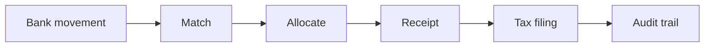

<div align="center">

# Situs

**Sovereign Capital System** — self-hosted property management for Portugal and Spain.

[](https://github.com/JIGLE/situs/actions/workflows/ci.yml)
[](https://github.com/JIGLE/situs/actions/workflows/security-scan.yml)
[](https://github.com/JIGLE/situs/actions/workflows/deploy-ghcr.yml)

[](https://github.com/JIGLE/situs/releases/latest)
[](https://nextjs.org)
[](https://www.typescriptlang.org)
[](LICENSE)

</div>

---

Most property tools stop at "record a payment." Situs is built around the part that actually
takes the time: proving _which month_ a given euro paid for, and keeping that provable all the
way to the tax authority.

Everything hangs off one spine — the **reference-month rent ledger**:



A CSV import or manual entry becomes a scored match against a lease; the allocation engine fills
the **oldest unpaid month first**; that writes a receipt, which drives a document lifecycle, which
feeds the tax connector — and every step appends to an immutable audit log. Tenant payment status
is _derived_ from this ledger, never hand-set.

> Formerly ProMan. The rebrand is complete: the app, the repository and the container images all
> read `situs`. For what shipped when, read the git tags and the GitHub Releases page — those are
> written by `release.yml` and cannot drift. This line previously carried a hardcoded version.

## Features

### The rent ledger (the core loop)

| Capability                 | What it does                                                                                                                                                                                                                |
| -------------------------- | --------------------------------------------------------------------------------------------------------------------------------------------------------------------------------------------------------------------------- |
| **Reference-month ledger** | One `RentPeriod` row per lease per month. Status is recomputed inside the same transaction as every allocation write — it can never drift from the money.                                                                   |
| **Waterfall allocation**   | Always fills the oldest not-fully-allocated period first, so partial payments can't silently skip a month. Pure engine, independently tested.                                                                               |
| **Bank matching**          | CSV/manual import → fingerprint dedupe (idempotent) → fuzzy-duplicate check → reconciliation rules → weighted confidence score. ≥ 0.85 auto-allocates; anything lower waits in the Bank Movements inbox for a human.        |
| **Receipt lifecycle**      | Money state (`paid`/`pending`) is kept separate from the _document_ state machine: draft → review → emitted → submitted → accepted/rejected, or voided from any pre-terminal state. Voiding soft-reverses live allocations. |
| **Tax connectors**         | One connector per user × country, locked to sandbox/review until explicitly promoted. Every call appends an immutable submission-log row.                                                                                   |
| **Audit trail**            | Scoped per-record or account-wide, persisted on every workflow mutation.                                                                                                                                                    |

### Portfolio and operations

- **Properties, units, buildings, tenants, owners** — with a structural portfolio tree and role-based access
- **Leases** — lifecycle, renewals, expiry alerts, bilingual PDF templates
- **Operations** — maintenance tickets with SLA due dates, evidence requirements, contractors, calendar
- **Documents + OCR** — upload and classification; ambiguous or unlinked results land in a review queue
- **Correspondence** — templates, bulk generation, SendGrid delivery
- **Intelligence** — occupancy, revenue and ROI analytics
- **Tenant portal** — token-gated self-service access, no account required
- **i18n** — Portuguese, English, Spanish, Italian (1,035 keys, full parity, enforced by test)

### 🇵🇹 Portugal

- **Recibos de Renda Eletrónicos** — AT-compatible XML payload, NIF validation, 5-day deadline enforcement
- **2026 IRS brackets** — 9 progressive bands (13.25% → 48%), plus the Renda Acessível flat 10% rate for rents ≤ €2,300/mo
- **SAF-T PT export** — RSA-SHA1 signature with invoice hash chain

### 🇪🇸 Spain

- **NRUA export** — Ventanilla Única Digital payload generation and registration tracking for 2026
- **Ley de Vivienda 12/2023** — rent-cap validation, stressed-zone deductions (50/60/70/90% tiers), _grandes tenedores_ detection
- **2026 IRPF brackets** — 6 progressive bands (19% → 47%)

### Payments and security

- **Stripe** card + SEPA Direct Debit, with full mandate lifecycle. Multibanco, MB WAY and Bizum need additional provider/banking setup by region.
- **PII encryption** — AES-256-GCM field-level encryption for IBAN, NIF and phone
- CSRF protection, nonce-based CSP, rate limiting (in-memory + Redis), JWT sessions

## Quick start

```bash
npm install
cp .env.example .env      # DATABASE_URL + NEXTAUTH_SECRET are the only must-haves
npm run dev
```

Open <http://localhost:3000>. Prefer to look before you configure? Every install ships a
read-only demo at `/demo` — 12 properties, 9 tenants, 10 leases of realistic data, no auth, no
writes.

### Docker

```bash
docker compose --profile prod up -d    # GHCR image
docker compose --profile dev up -d     # build from source
```

## Tech stack

| Layer      | Technology                                             |
| ---------- | ------------------------------------------------------ |
| Framework  | Next.js 16 (App Router)                                |
| Language   | TypeScript (strict)                                    |
| Database   | Prisma ORM + SQLite (`better-sqlite3`)                 |
| Auth       | NextAuth.js (Google OAuth + credentials)               |
| UI         | shadcn/ui + Tailwind CSS v4 + Radix UI + Framer Motion |
| Validation | Zod                                                    |
| i18n       | next-intl (pt / en / es / it)                          |
| Email      | SendGrid                                               |
| Payments   | Stripe (card + SEPA DD)                                |
| Testing    | Vitest (unit/integration) + Playwright (E2E)           |
| Deployment | Docker / TrueNAS SCALE                                 |

## Architecture

The domain logic that matters is factored into **pure engines** with Prisma orchestration layered
on top, so the money rules are testable without a database.

```
app/
  [locale]/(main)/     → owner-facing pages (portfolio, financials, people,
                         operations, leases, documents, intelligence, settings…)
  tenant-portal/       → token-gated tenant self-service
  api/                 → 49 domain route folders (Zod-validated, session-checked)
components/
  features/            → domain components, one folder per pillar
  ui/                  → shadcn/ui primitives + responsive primitives
  shared/              → cross-cutting (audit trail, entity detail overlay…)
lib/
  services/
    allocation/        → reference-month waterfall engine (pure) + orchestration
    matching/          → bank-movement→lease confidence scoring (pure)
    bank/              → CSV import, fingerprint dedupe, matching pipeline
    receipts/          → receipt document-lifecycle state machine (pure)
    ocr/               → document classification engine (pure) + orchestration
    tax/               → connector find-or-create + submission log
  tax/connectors/      → per-country TaxConnector implementations
  contexts/            → global AppState, CSRF, toast, currency
  utils/               → PII encryption, API client, logger, env validation
prisma/
  schema.prisma        → 47 models, 33 enums (SQLite)
scripts/
  mobile-audit.mjs     → responsive measurement harness (see Quality gates)
```

## Configuration

Only three variables are required to boot:

| Variable          | Description                           |
| ----------------- | ------------------------------------- |
| `DATABASE_URL`    | SQLite path, e.g. `file:./dev.db`     |
| `NEXTAUTH_URL`    | Public base URL                       |
| `NEXTAUTH_SECRET` | Session signing secret (min 32 chars) |

Recommended in production:

| Variable             | Description                                                                                                                                                     |
| -------------------- | --------------------------------------------------------------------------------------------------------------------------------------------------------------- |
| `PII_ENCRYPTION_KEY` | **Required in production** — 64-char hex key for AES-256-GCM PII encryption. The app refuses to start without it; set `ALLOW_UNENCRYPTED_PII=true` to override. |
| `CRON_SECRET`        | Bearer token for `POST /api/cron/notifications`                                                                                                                 |
| `INIT_SECRET`        | Protects DB init and debug endpoints                                                                                                                            |
| `ENABLE_DEMO_LOGIN`  | Set `false` to disable demo login                                                                                                                               |

Integrations are opt-in and off by default — `ENABLE_STRIPE`, `ENABLE_SENDGRID`, `ENABLE_OAUTH`,
and `ENABLE_BILLING` (plan limits; self-hosted stays unlimited unless you turn it on). Portugal
SAF-T signing adds `SAFT_SIGNING_KEY_PATH` and `SAFT_CERTIFICATE_NUMBER`.

See [.env.example](.env.example) for the complete list.

## Quality gates

```bash
npm run verify:ci      # type-check + lint + test (what CI runs)
npm test               # Vitest — 94 files, 1,054 tests
npm run test:coverage  # coverage report
npm run test:e2e       # Playwright
```

Enforced on every PR:

- **TypeScript** strict, `--noEmit` must pass
- **ESLint** `--max-warnings=0` — zero warnings
- **Vitest** with coverage floors of 70% statements / 70% lines / 60% branches / 60% functions
- **Mobile audit** — `scripts/mobile-audit.mjs` walks 26 surfaces × 2 themes at 390×844 against
  real seeded data, measuring horizontal overflow, touch targets, clipping and text legibility.
  Currently **0 horizontal overflow and 0 touch-target violations across all 52 surface-runs**.
  Advisory in CI today, ratcheting to blocking.

The responsive rules the harness enforces are documented in [CLAUDE.md](CLAUDE.md) alongside the
screen-density rules — both were derived from measured audits rather than taste.

## Deployment

| Target        | Resources                                                           |
| ------------- | ------------------------------------------------------------------- |
| Docker        | [Dockerfile](Dockerfile) · [docker-compose.yml](docker-compose.yml) |
| TrueNAS SCALE | [docs/truenas.md](docs/truenas.md)                                  |

Deployed as a Docker container. TrueNAS SCALE runs it as a Custom App — see the guide above for
storage, environment and update steps.

Daily notifications (rent reminders, overdue notices, lease renewals, receipt deadlines) run via
`POST /api/cron/notifications`, authenticated with `CRON_SECRET`. Schedule it with any cron runner
that can make an authenticated HTTP request.

Full instructions: [docs/deployment.md](docs/deployment.md).

## Database

SQLite via Prisma with the `better-sqlite3` adapter.

```bash
npx prisma migrate deploy   # apply pending migrations
npx prisma generate         # regenerate client after schema changes
npx prisma studio           # browse
```

See [Database Strategy](docs/DATABASE_STRATEGY.md) for migrations, backups and production
guidance.

## Documentation

| Guide                                                  | Description                             |
| ------------------------------------------------------ | --------------------------------------- |
| [Documentation index](docs/README.md)                  | All available guides                    |
| [Deployment](docs/deployment.md)                       | Production setup                        |
| [TrueNAS SCALE](docs/truenas.md)                       | Step-by-step NAS deployment             |
| [Security](docs/SECURITY.md)                           | Security architecture                   |
| [Database strategy](docs/DATABASE_STRATEGY.md)         | Migrations, backups                     |
| [Metrics & monitoring](docs/METRICS_AND_MONITORING.md) | Observability                           |
| [Troubleshooting](docs/troubleshooting.md)             | Common issues                           |
| [Releases](RELEASES.md)                                | Version history                         |
| [CLAUDE.md](CLAUDE.md)                                 | Architecture patterns + design doctrine |

## Contributing

See [CONTRIBUTING.md](CONTRIBUTING.md).

## License

Proprietary — all rights reserved. See [LICENSE](LICENSE).
