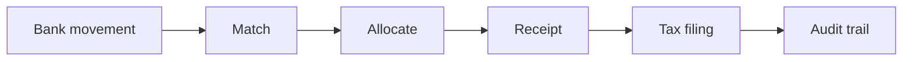

<div align="center">

# Situs

**Sovereign Capital System** — self-hosted property management for Portugal.

[](https://github.com/JIGLE/situs/actions/workflows/ci.yml)
[](https://github.com/JIGLE/situs/actions/workflows/security-scan.yml)
[](https://github.com/JIGLE/situs/actions/workflows/deploy-ghcr.yml)

[](https://github.com/JIGLE/situs/releases/latest)
[](https://nextjs.org)
[](https://www.typescriptlang.org)
[](LICENSE)

</div>

---

Most property tools stop at "record a payment." Situs is built around the part that actually
takes the time: proving _which month_ a given euro paid for, and keeping that provable all the
way to the tax authority.

Everything hangs off one spine — the **reference-month rent ledger**:



A bank movement — imported from CSV, entered by hand or synced from a live bank connection —
becomes a scored match against a lease; the allocation engine fills
the **oldest unpaid month first**; that writes a receipt, which drives a document lifecycle, which
feeds the tax connector — and every step appends to an immutable audit log. Tenant payment status
is _derived_ from this ledger, never hand-set.

> Formerly ProMan. For what shipped when, read the git tags and the GitHub Releases page, which
> `release.yml` writes.

## Features

### The rent ledger (the core loop)

| Capability                 | What it does                                                                                                                                                                                                                                |
| -------------------------- | ------------------------------------------------------------------------------------------------------------------------------------------------------------------------------------------------------------------------------------------- |
| **Reference-month ledger** | One `RentPeriod` row per lease per month. Status is recomputed inside the same transaction as every allocation write — it can never drift from the money.                                                                                   |
| **Waterfall allocation**   | Always fills the oldest not-fully-allocated period first, so partial payments can't silently skip a month. Pure engine, independently tested.                                                                                               |
| **Bank matching**          | CSV/manual import or a live PSD2 sync → fingerprint dedupe (idempotent) → fuzzy-duplicate check → reconciliation rules → weighted confidence score. ≥ 0.85 auto-allocates; anything lower waits in the Bank Movements inbox for a human.    |
| **Receipt lifecycle**      | Money state (`paid`/`pending`) is kept separate from the _document_ state machine: draft → review → emitted → submitted → accepted/rejected. A receipt can be voided from draft, review or emitted; voiding soft-reverses live allocations. |
| **Tax connectors**         | One connector row per user and connector key, in sandbox or review mode: no live AT integration exists, so live mode fails closed. Every call appends an immutable submission-log row.                                                      |
| **Audit trail**            | Scoped per-record or account-wide, persisted on every workflow mutation.                                                                                                                                                                    |

### Portfolio and operations

- **Properties, buildings, tenants, owners** — with a structural portfolio tree and role-based access
- **Leases** — lifecycle, renewals, expiry alerts, bilingual PDF templates
- **i18n** — Portuguese, English, Spanish, Italian (full parity, enforced by test — `npm run i18n:check:strict` counts them, so this line does not)

### 🇵🇹 Portugal

- **Recibos de Renda Eletrónicos** — AT-compatible XML payload, NIF validation, 5-day deadline enforcement

### Security

- **PII encryption** — AES-256-GCM field-level encryption for IBAN, NIF and phone
- CSRF protection, nonce-based CSP, rate limiting (in-memory + Redis), JWT sessions

## Quick start

```bash
npm ci
cp .env.example .env      # DATABASE_URL + NEXTAUTH_SECRET are the only must-haves
npm run dev
```

Open <http://localhost:3000>. The first account created owns the instance; every other email is
refused until you add it to `AUTH_ALLOWED_EMAILS`.

### Docker

```bash
docker compose --profile prod up -d    # GHCR image
docker compose --profile dev up -d     # build from source
```

## Tech stack

| Layer      | Technology                                             |
| ---------- | ------------------------------------------------------ |
| Framework  | Next.js 16 (App Router)                                |
| Language   | TypeScript (strict)                                    |
| Database   | Prisma ORM + SQLite (`better-sqlite3`)                 |
| Auth       | NextAuth.js (Google OAuth + credentials)               |
| UI         | shadcn/ui + Tailwind CSS v4 + Radix UI + Framer Motion |
| Validation | Zod                                                    |
| i18n       | next-intl (pt / en / es / it)                          |
| Email      | SMTP (Brevo by default; any provider)                  |
| Testing    | Vitest (unit/integration) + Playwright (E2E)           |
| Deployment | Docker / TrueNAS SCALE                                 |

## Architecture

The domain logic that matters is factored into **pure engines** with Prisma orchestration layered
on top, so the money rules are testable without a database.

```
app/
  [locale]/(main)/     → owner-facing pages (portfolio, financials, people,
                         leases, compliance, settings…)
  api/                 → one folder per domain (Zod-validated, session-checked)
components/
  features/            → domain components, one folder per pillar
  ui/                  → shadcn/ui primitives + responsive primitives
  shared/              → cross-cutting (audit trail, entity detail overlay…)
lib/
  services/
    allocation/        → reference-month waterfall engine (pure) + orchestration
    matching/          → bank-movement→lease confidence scoring (pure)
    bank/              → CSV import, fingerprint dedupe, matching pipeline
    receipts/          → receipt document-lifecycle state machine (pure)
    tax/               → connector find-or-create + submission log
  tax/connectors/      → the Portuguese TaxConnector
  contexts/            → global AppState, CSRF, toast, currency
  utils/               → PII encryption, API client, logger, env validation
prisma/
  schema.prisma        → the schema; `grep -c '^model ' prisma/schema.prisma` counts it
scripts/
  mobile-audit.mjs     → responsive measurement harness (see Quality gates)
```

## Configuration

Only three variables are required to boot:

| Variable          | Description                           |
| ----------------- | ------------------------------------- |
| `DATABASE_URL`    | SQLite path, e.g. `file:./dev.db`     |
| `NEXTAUTH_URL`    | Public base URL                       |
| `NEXTAUTH_SECRET` | Session signing secret (min 32 chars) |

Recommended in production:

| Variable             | Description                                                                                                                                                                     |
| -------------------- | ------------------------------------------------------------------------------------------------------------------------------------------------------------------------------- |
| `PII_ENCRYPTION_KEY` | **Required in production** — 64-char hex key for AES-256-GCM PII encryption. Without it the app refuses to start, naming this variable; `ALLOW_UNENCRYPTED_PII=true` overrides. |
| `CRON_SECRET`        | Bearer token for the three `/api/cron/*` endpoints (notifications, data retention, bank sync); each answers 503 while it is unset                                               |
| `INIT_SECRET`        | Production bearer for the DB init endpoint; unset, it answers 403                                                                                                               |
| `METRICS_TOKEN`      | Production bearer for `/api/metrics`; unset, it answers 403                                                                                                                     |
| `ENABLE_DEMO_LOGIN`  | `true` enables demo credentials that grant **ADMIN** — leave it unset in production                                                                                             |

Google sign-in is opt-in and off by default: `ENABLE_OAUTH`.

See [.env.example](.env.example) for the complete list.

## Quality gates

```bash
npm run verify:ci      # type-check, lint, format, hygiene, npm audit, tests
npm test               # Vitest
npm run test:coverage  # coverage report
npm run test:e2e       # Playwright
```

Enforced on every PR:

- **TypeScript** strict, `--noEmit` must pass
- **ESLint** `--max-warnings=0` — zero warnings
- **Vitest** with a coverage ratchet in `vitest.config.ts` — a PR may not lower it
- **Mobile audit** — `scripts/mobile-audit.mjs` walks every owner-facing surface in both themes at
  390×844 against seeded data, measuring horizontal overflow, touch targets, clipping and text
  legibility. A blocking `--strict` gate against the `BASELINE` in the harness; a 1440×900
  Portuguese pass runs alongside it as advisory.

The responsive rules the harness enforces are documented in [CLAUDE.md](CLAUDE.md) alongside the
screen-density rules — both were derived from measured audits rather than taste.

## Deployment

| Target        | Resources                                                           |
| ------------- | ------------------------------------------------------------------- |
| Docker        | [Dockerfile](Dockerfile) · [docker-compose.yml](docker-compose.yml) |
| TrueNAS SCALE | [docs/truenas.md](docs/truenas.md)                                  |

Deployed as a Docker container. TrueNAS SCALE runs it as a Custom App — see the guide above for
storage, environment and update steps.

Daily notifications (rent reminders, overdue notices, lease renewals, receipt deadlines) run via
`POST /api/cron/notifications`, authenticated with `CRON_SECRET`. Schedule it with any cron runner
that can make an authenticated HTTP request.

## Database

SQLite via Prisma with the `better-sqlite3` adapter. The container applies the schema itself on
every start; in development:

```bash
npx prisma db push          # apply schema changes
npx prisma generate         # regenerate client after schema changes
npx prisma studio           # browse
```

See [Database Strategy](docs/DATABASE_STRATEGY.md) for how the schema reaches a database, backups
and the scale plan.

## Documentation

| Guide                                          | Description                             |
| ---------------------------------------------- | --------------------------------------- |
| [Documentation index](docs/README.md)          | All available guides                    |
| [TrueNAS SCALE](docs/truenas.md)               | Step-by-step NAS deployment             |
| [Security](docs/SECURITY.md)                   | Security architecture                   |
| [Database strategy](docs/DATABASE_STRATEGY.md) | Migrations, backups                     |
| [Monitoring](docs/MONITORING.md)               | Observability                           |
| [CLAUDE.md](CLAUDE.md)                         | Architecture patterns + design doctrine |

## Contributing

See [CONTRIBUTING.md](CONTRIBUTING.md).

## License

Proprietary — all rights reserved. See [LICENSE](LICENSE).
